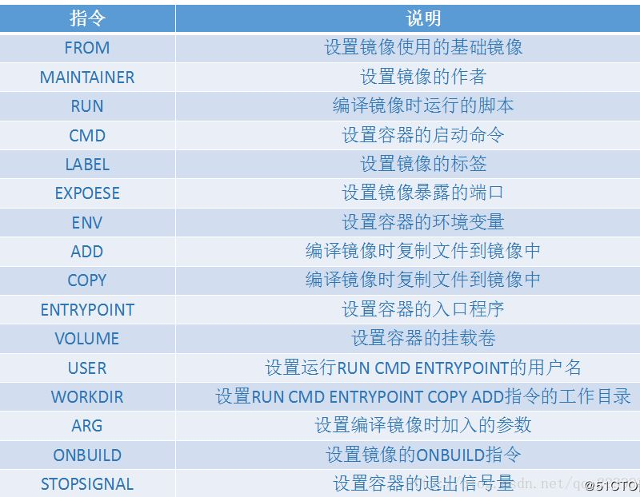

# 命令部分
官网：https://docs.docker.com
## 信息
```bash
docker version          # 版本信息
docker info             # 系统信息
docker help 
docker 命令 --help
```

## 镜像
```bash
docker images           # 查看可用镜像
    -a                  # 显示所有
    -q                  # 仅显示id
```
```bash
docker search [查找]      # 查找
docker search mysql
```
```bash
docker pull 
docker pull mysql
docker pull mysql:5.7
# 无tag默认latest
# 分层下载 （核心）若存在不同版本，则不会下载重复文件
```
```bash
docker rmi              # 删除镜像
docker rmi aid bid cid
docker rmi $(docker images -aq) # 全部删掉
```

## 容器
```bash
docker run 可选镜像 [镜像名称]
    --name="NAME"
    -d                  # 后台运行
    -i                  # 交互式
    -t                  # 终端
    -p                  # 指定端口
        -p ip:主机端口:容器端口
        -p 宿主机端口:容器端口
        -p 11334:8080   
        -p 容器端口      # 不往外
        -p 3000
    -P                  # 随机端口
    -v                  # 挂载数据卷
        -v 主机目录:容器内目录
    --name              # 取名
    --rm                # 停止即删除
```
```bash
docker ps # 显示运行的容器
    -a      # 历史运行的容器
    -n=?       # 最近的容器
    -q          # 容器的编号
```
```bash
exit            # 容器停止推出
ctrl+P+Q        # 不停止推出
```
```bash
docker rm [容器id]
    -f          # 可以删除运行中的容器
docker rm $(docker ps -aq)
docker ps -aq | xargs docker rm
```
```bash
docker start 容器id
docker restart 容器id
docker stop 容器id
docker kill 容器id
```
```bash
docker stats            # 查看运行中的容器的利用信息
    -a                  # 查看所有的
```

## 日志等进阶命令
### 日志
```bash
docker logs 容器id
    -t                  # 附带时间戳
    -f                  # 在接下来输出
    --tail  num
    -n num              # 输出后几条
```
### 进程
```bash
docker top 容器id       # 查看容器进程信息
```
### 元数据
```bash
docker inspect id
```
### 进入容器
```bash
docker exec 容器id      # 新建终端进入容器
    -i
    -t          # 同上，交互模式，在终端中
```
```bash
docker attach 容器id        # 进入当前容器运行的终端
```
### 拷贝容器数据到宿主机
```bash
docker cp 容器id:容器内欲拷贝文件路径 宿主机拷贝目标文件路径
```
之后可以使用 -v 卷技术同步宿主机和容器的内容

## 提交
```bash
docker commit -m="描述信息" -a="作者" 容器id 目标镜像名:[TAG] # 提交容器的修改，保存为一个镜像
```
## 查看卷数据
```bash
docker volume
    create          # 创建卷
    inspect         # 显示卷信息
    ls              # 列举卷
    prume           # 移除所有为使用的卷
    rm              # 移除卷
```
## dockerfile
```bash
docker build    目录
    -f      文件地址
    -t      生成目标:tag

```
### dockersfile文件

> copy 会自动解压，add不会

1. 指令均大写
2. 从上到下依次执行
3. `#`为注释